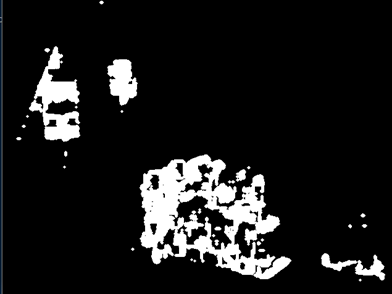

## Eskişehir Technical University – Dept. of CENG 
### BIM 496 Computer Vision – Spring 2019-2020 Project Proposa

##### Project name: Motion Detection and Object Tracking with Optical Flow

<h2> Result </h2> 

  <a href="https://www.youtube.com/watch?v=X9WP686YMhk"><a>

### Problem definition

Motion capture is the process of detecting a change in position of an object relative to its 
surroundings or a change in the surroundings relative to an object. While simple algorithms 
can work with fixed camera systems for motion detection, such systems are not always 
attainable due to the nature of motion. More complex algorithms such as optical flow can 
be used to detect motion using a moving camera and it is able to distinguish between 
background motion caused by the camera and that of independent objects moving in the 
scene.
In this project we are going to implement an optical flow model for detecting motion. 
Optical flow can be used in many areas, including object detection and tracking, movement 
detection, and robot navigation. 
We will implement a base code which can be used for different areas such as tracking or 
counting objects. The objects can be vehicles, persons, or any other entities with motion.
We are using motion detection to track objects
### How Did We Achieve The Goal

In this project we use Lucas-Kanade optical flow algorithm for detecting motion. This 
algorithm gives us the motion vectors and according to these vectors we can detect the 
motion and the direction of movement.
After getting the motion we apply some image processing operations. These operations give
us the ability to detect the moving object place and drawing a bounding box around the 
object.
### Lucas-Kanade Optical Flow Algorithm

The Lucas-Kanade optical flow algorithm is a simple technique which can provide an 
estimate of the movement of interesting features in successive images of a scene. Interesting 
features are defined as those which exhibit enough intensity gradient information. So, the 
method heavily relies on intensity gradients being non-negligible, i.e. no flat surfaces.
Some key assumptions are made by the algorithm: 1)Brightness constancy – projection of 
same points look the same on every frame, 2)Small motion – points do not move very far, 
3)Spatial coherence – points move like their neighbors.
The Lucas-Kanade algorithm makes a “best guess” of the displacement of a neighborhood 
by looking at changes in pixel intensity which can be explained from the known intensity 
gradients of the image in that neighborhood. For a simple pixel we have two unknowns (u 
and v) and one equation (that is, the system is underdetermined). We need a neighborhood
to get more equations. Doing so makes the system overdetermined and we have to find a 
least squares solution. The LSQ solution averages the optical flow guesses over a 
neighborhood.
### What are the algorithms, methods?
We are first taking frames from video. To get optical flow result we need 2 sequential 
frames. After getting frames we are using the Lucas-Kanade optical flow algorithm. This 
algorithm gives us two output vectors “u” and “v” one of them is horizontal and the other 
is vertical flow vector. 
We are looking the values of the flow vectors and if the values are bigger than 0 we are 
drawing a circle at that pixel.

  

We are drawing circles because we will use these for detecting objects’ places and drawing 
bounding boxes around them. This image is just for illustration purposes, we are drawing 
these circles on a empty black mask with 255 pixel values ,so we can use these masks later 
for detecting contours.

  

This is the real image that we are using. In this image there are some gaps between the white
pixels and we want to make them completely white and while doing this we want to keep 
separete the different objects.
To do this we are using erosion and dilation operations. After applying these operations we 
have an image like this.

  

After these operations we have an image without any black gap inside the object. Now we can 
use these images for detecting the contours. For this we use OpenCV’s findContours() function. 
This give us a result like these.

  

By using these contours we can get the bounding boxes for tracking the object. To do this 
we use approxPolyDP and boundingRect OpenCV functions and we can get the bounding 
boxes.

  

But we can have some noise like in these images. To handle this issue we are using some filter operations, we are looking at some features of 
the bounding boxes and eliminating others. Like very big one or very tiny ones etc. Before and After...

   

This is the after filter operation. Now we have bounding boxes. We need to track these 
boxes. Calculating optical flow for every frame is very slow so, to make this operation a little 
bit fast we use opencv multi tracker ( cv.MultiTracker_create() )
We are giving the bounding boxes to the tracker and tracker track these boxes for around 
50-100 frames and after 100 frames we againg calculate the optical flow because some times 
new object can be come up and some of them can be exit the video.

### How much of the code is built-in OpenCV functions?
We have implemented the crux of the optical flow algorithm ourselves. Our algorithm is a 
simplified and naïve approach to a sparse optical flow method, as it does not take into 
account several optimization techniques that have been developed since the algorithm was originally published, such as the Coarse-to-fine optical flow estimation method employed by 
OpenCV’s implementation.
As a result, our implementation is not very state-of-the-art and works best if the movements 
are small, but as the results show still does an impressive job.
While we have implemented the optical flow algorithm from scratch, we did have to rely on 
several of OpenCV’s methods as well for image processing. Main ones we have used 
include: goodFeaturesToTrack() to find the strongest corners using the Shi-Tomasi method; 
MultiTracker_create() to track multiple objects; findContours() for find contours; and 
several smaller functions that does things like color conversion, dilation, video capture, etc